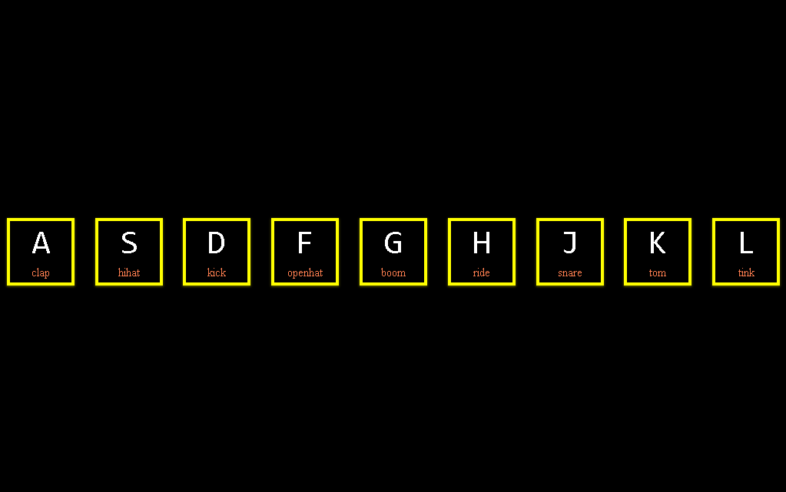

# Kit de batería

## Construido con 🛠️

_Herramientas utilizadas para crear el proyecto_

* [JS](#) - Vanilla JS
* [HTML](#) - HyperText Markup Language
* [CSS](#) - Cascading Style Sheets
* [KEYCODE](http://keycode.info/) - Para obtener el código clave del evento JavaScript