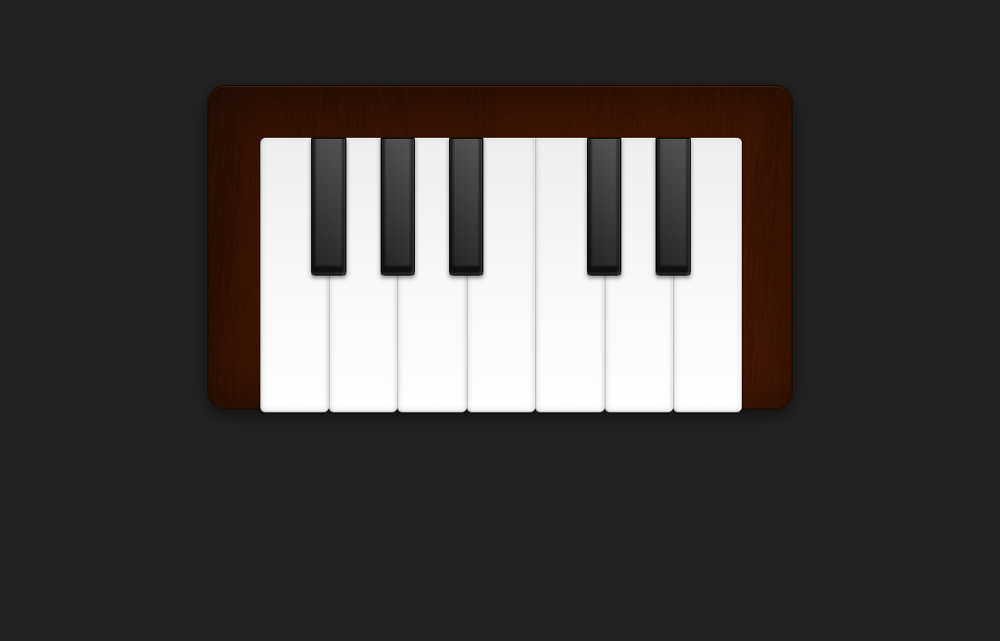

# Piano 🎹

## Construido con 🛠️

_Herramientas utilizadas para crear el proyecto_

* [JS](#) - Vanilla JS
* [HTML](#) - HyperText Markup Language
* [CSS](#) - Cascading Style Sheets
* [API audio](https://developer.mozilla.org/en-US/docs/Web/API/Web_Audio_API) - API de audio web

## Referencias de Autores ✒️

_Menciona a todos las citas_

* **Philip Zastrow** - *CSS Piano* - [codepen](https://codepen.io/zastrow/pen/oDBki)
* **Como afinar pianos** - *Tabla de frecuencias de las notas de un piano* - [comoafinarpianos.com](http://comoafinarpianos.com/afinacion-de-pianos-tutorial-nivel-intermedio/)