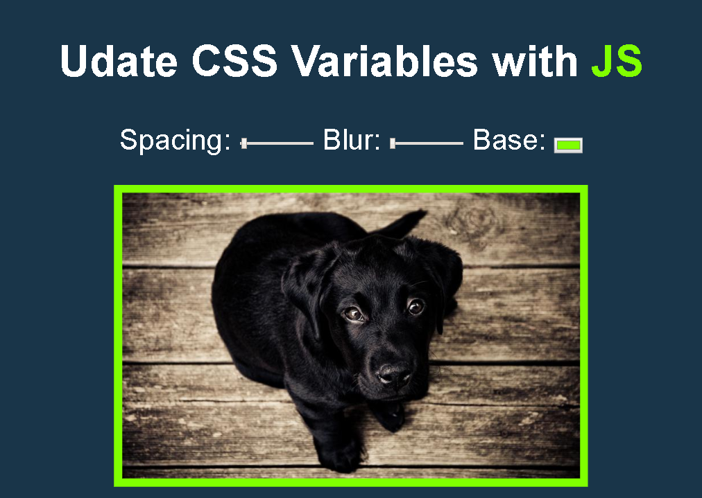

# Playing with variables CSS y JS

## Construido con 🛠️

_Herramientas utilizadas para crear el proyecto_

* [JS](#) - Vanilla JS
* [HTML](#) - HyperText Markup Language
* [CSS](#) - Cascading Style Sheets